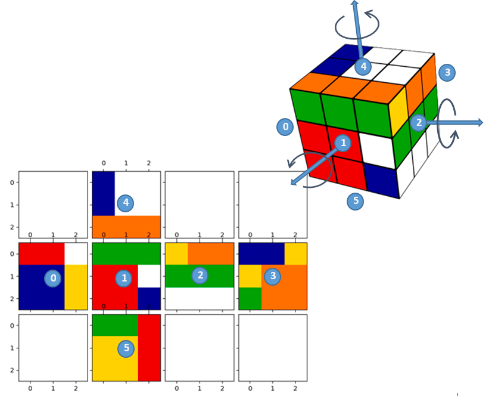

# pyRubikSim

*Python utils to simulate a **Rubik's Cube**. The aim of this code is to give a simple rubik cube simulator to test Discrete Planning Techniques.
The code was developed for AI teaching purpose.

*Also I have included a code file adapted from David Hogg <https://github.com/davidwhogg/MagicCube> to allow the 3D visualization of the cube

*prof.: Miguel Hernando (2017)*

### LIB REQUIREMENTS: 
**Numpy** is used for face representation and operation **Matplotlib** only for drawing.
```
pip3 install numpy
pip3 install mathplotlib
```


Universidad Politécnica de Madrid


<https://github.com/mhernando/pyRubikSim>

 
### STATE CONVENTIONS:



The figure shows the face state order as it is internally represented.

Each face is represented by state matrix (NxN) and each cell is an integuer (0-5).
Row and columns are disposed with the origin at the upper left corner, with faces disposed as the unfolded cube states.

Rotations are referred to axis relative faces.
- The outward-pointing normal of face 1 is the X axis.
- The outward-pointing normal of face 2 is the Y axis.
- The outward-pointing normal of face 4 is the Z axis.

Rotations are considered positive if they are ccw around the axis (math positive rotation)
The  cube slices are considered as layers. The upper layer (faces 1, 2 or 4) have index 0, while de
backward layers (3,0,5) have index N-1 (N is the cube dimension)

Initial colors have the same index than their respective faces

###example of use:
```
import rub_cube as rb
b=rb.RubCube(3)
b.rotate_90('x',0,1)
b.rotate_90('y',1,1)
b.plot()
a=b.get_State()
```